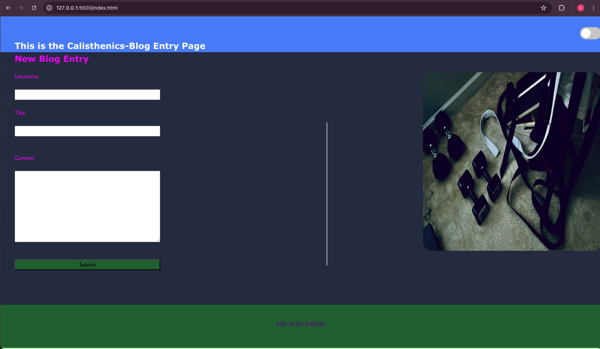
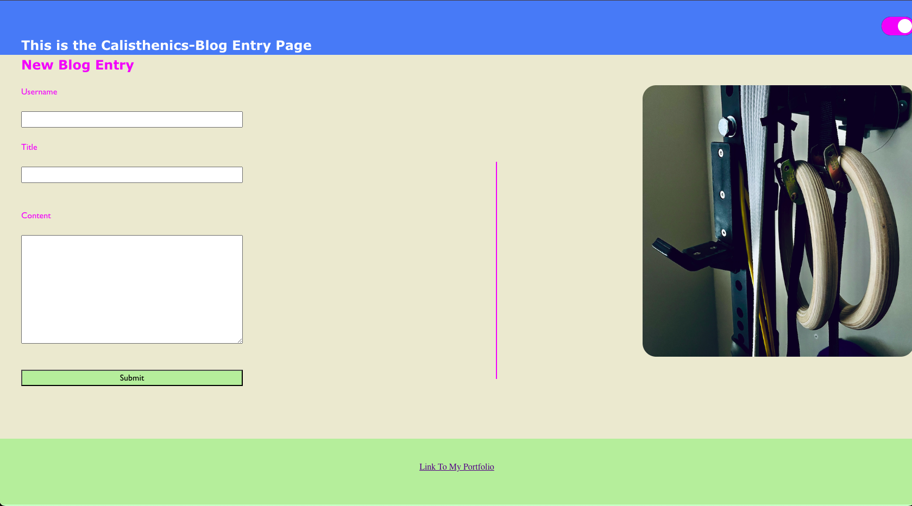
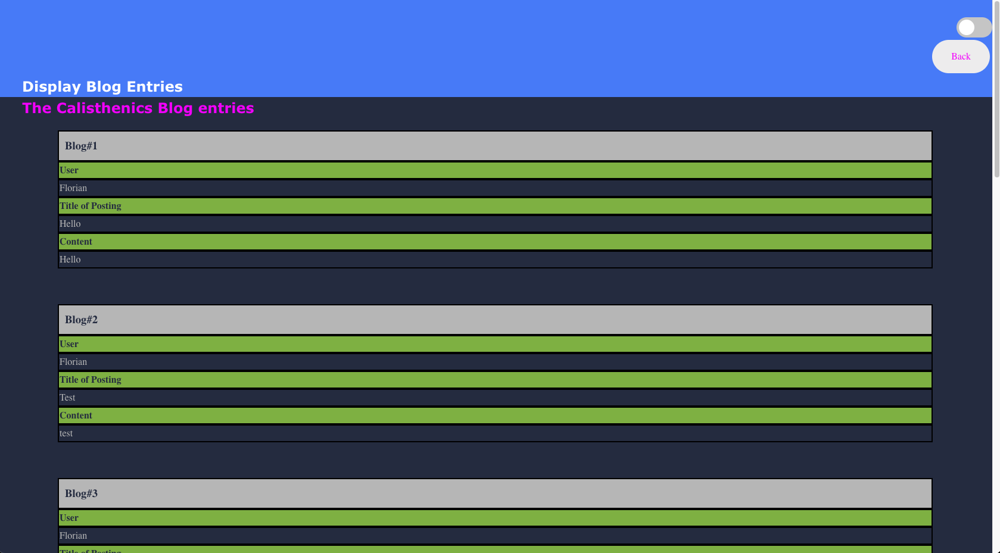

# A Blog Page for Calisthenics Enthusiasts

## Description

Provide a short description explaining the what, why, and how of your project. Use the following questions as a guide:

- Motivation was to give people a platform to share the knowledge of how specific calisthenics exercise work and what goes around the 
lifestyle.
- I am a sports fanatic and when I was injured last year the only way to keep me fit was through strength work.
This lead to my love for calisthenics.
- With this blog I try to give a platform for all the enthusiasts out there to share their experiance and share mine as well
- I learned how to combine html pages, how to create dynamically elements in js and use the local-storage of the browser as "database".

## Usage

The landing page has an image and the default is the dark mode. When using the toggle the screen goes to light mode and the image changes.
When you enter a Blog Entry you hit the "Submit" button and the application takes you to the actual blog page where all the entries are displayed. The "Back" button takes you back to the landing page. The mode can be changed as well on this page from dark to light. There is a background picture on the buttom that changes as well. The link in the footer will take you to my portfolio page.

## Credits

I used the following pages as help:

https://www.w3schools.com/html/

https://stackoverflow.com/

I also used our class content as help to establish the functionality of the page.

## License

MIT Licence is used